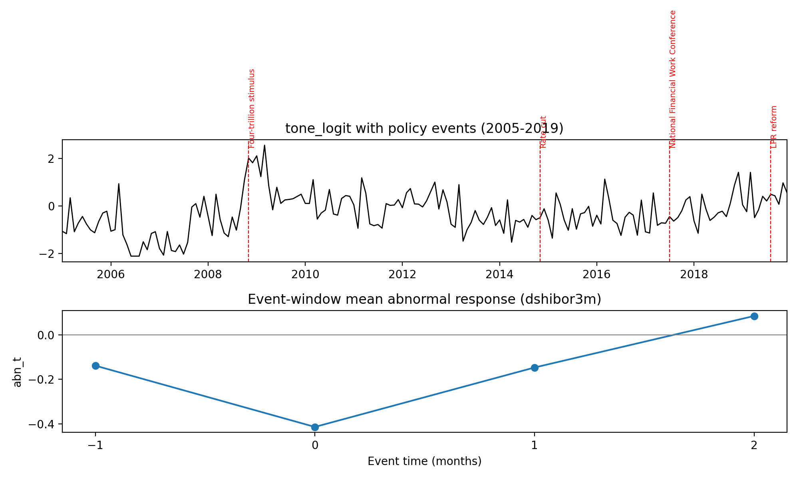
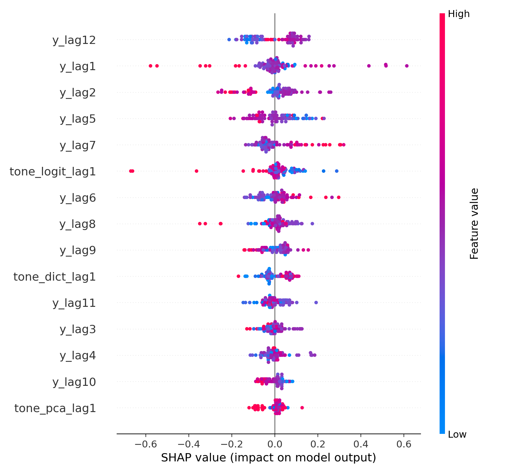

# Authority Media Tone and Financial Conditions Forecasting (People’s Daily, Weak Supervision)
# 权威媒体语调与金融条件预测（人民日报 × 弱监督学习）

**Author/作者:** Blank (Fudan Univ., School of Economics)

This repo is a *traceable / reproducible* record of my course paper project.

- 📄 Paper (PDF): [`paper/paper_public.pdf`](./paper/paper_public.pdf)
- 🔁 Reproduction notes: [`REPRODUCE.md`](./REPRODUCE.md)
- 🖼️ Key figures: [`results/figures/`](./results/figures/)
- 📊 Tables / outputs: [`results/tables/`](./results/tables/)
- 🧠 Source code: [`src/`](./src/)

---

## Abstract / 摘要

**EN**: We construct a monthly policy communication (tone) index from the full-text *People’s Daily* corpus and test whether it adds *out-of-sample* predictive power for financial conditions (short-rate changes). To balance interpretability and generalization, we adopt a **weakly supervised learning** approach: dictionary priors generate weak labels, which are used to train a classifier (logit) and produce a tone index (`tone_logit`). Under a strict **rolling out-of-sample** setup with **Clark–West** tests, `tone_logit` shows marginal predictive power for Shibor 3M changes in the **pre-COVID** subsample and aligns with major policy-event windows (e.g., 2008 stimulus).

**中文**：本文基于《人民日报》全量文本语料构建月度政策沟通（语调）指数，并在严格的滚动样本外预测框架下检验其对金融条件（以短端利率变化为代理）的增量预测能力。为兼顾解释性与泛化能力，本文引入**弱监督学习**：使用词典先验生成弱标签，训练逻辑回归分类器得到指数 `tone_logit`。在滚动样本外预测与 Clark–West 检验下，`tone_logit` 在**疫情前**子样本中对 Shibor 3M 的变化呈现边际预测能力，并在“四万亿”等政策窗口期具备方向一致性。

---

## What’s inside / 仓库内容

```text
.
├── paper/
│   └── paper_public.pdf
├── src/                     # pipeline scripts
├── config/
│   └── run_config.json
├── results/
│   ├── figures/
│   └── tables/
├── REPRODUCE.md
└── requirements.txt
```

> Note: the original corpus is course-provided and not included here.

---

## Results snapshot / 结果速览

- Event-study style validation figure:

  

- Model interpretability (XGBoost SHAP summary used as a robustness/diagnostic):

  

---

## Quick start (code only) / 快速运行（仅代码）

```bash
python -m venv .venv && source .venv/bin/activate
pip install -r requirements.txt
```

Then follow [`REPRODUCE.md`](./REPRODUCE.md).

---

## Citation / 引用

If you find this useful, please cite the paper PDF in `paper/`.

---

## License / 许可

Code: MIT (recommended). Data/corpus: copyrighted by the publisher / course provider.
